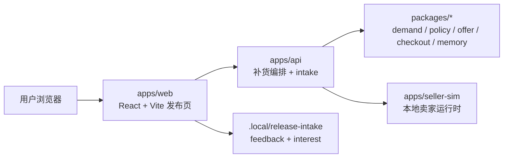

# OpenClaw Release V1 Architecture

## 一句话

OpenClaw Release V1 是一个本地优先、中文优先的 Agent Native 补货产品。`apps/web` 是发布表面，`apps/api` 和 `apps/seller-sim` 是支撑运行与解释的本地服务。

## 发布边界

当前发布版只对下面这条链路负责：

1. 用户进入 Web 页面
2. 选择家庭补货或办公室采购场景
3. 运行 `Demo` 或本地 `Live`
4. 查看决策时间线与订单解释
5. 提交反馈或留下邮箱

不在发布边界内的内容：

- browser extension 的健康度
- 真实支付与真实下单
- 外部商城接入
- 云端多租户能力

## 运行结构



## 模块职责

### `apps/web`

发布产品本身，负责：

- 首页叙事
- 场景切换
- Demo / Live 路径切换
- 时间线展示
- 解释面板
- 反馈和邮箱表单

### `apps/api`

本地 buyer API，负责：

- 接收补货 intent
- 调用 orchestrator
- 返回 explanation
- 本地持久化反馈和邮箱

### `apps/seller-sim`

本地 seller runtime，负责：

- 询价
- 排序
- 锁库
- 提交

### `packages/*`

共享领域能力，负责：

- demand planner
- policy engine
- offer evaluator
- checkout
- orchestration
- memory

## 运行模式

### `Demo`

默认路径。特点：

- 不依赖本地服务
- 页面稳定
- 适合首次体验和对外分享

### `Live`

联调路径。特点：

- 依赖本地 `apps/api` 和 `apps/seller-sim`
- 用来证明前端并不是假数据
- 不是用户第一次进入时必须依赖的路径

## 本地数据

发布版当前只持久化两类数据：

- 用户反馈
- 候补邮箱

默认目录：

- `.local/release-intake`

这让 `V1` 保持真实可用，但不引入数据库和部署依赖。

## 运行命令

一键启动：

```bash
pnpm start:release
```

一键验证：

```bash
pnpm verify:release
```

浏览器发布流验证：

```bash
pnpm test:e2e:release
```

## 架构原则

- 发布版只为 `apps/web` 负责，不为整个历史仓库背锅
- Demo 默认稳定，Live 作为可信佐证
- 所有用户 CTA 都必须真实落地
- README、脚本、测试和文档必须描述同一个产品
