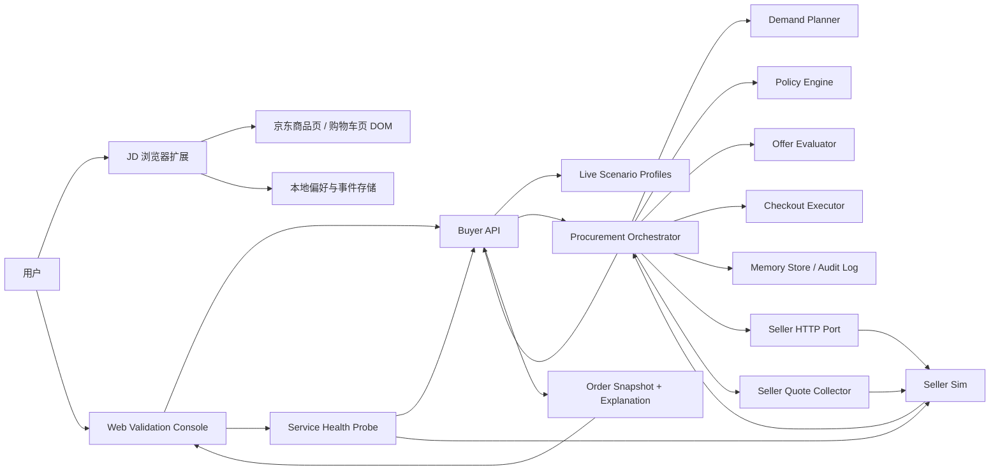

# Claw Native 当前系统架构说明

**版本基线：** `codex/openclaw-web-validation` 分支，提交 `d9bde3c`  
**文档目的：** 用“当前真实实现”解释 Claw Native 的电商系统究竟是什么，不再混用长期愿景和已经落地的代码。

## 1. 一句话定义

Claw Native 当前不是一个传统“电商站点”，也不是一个只会推荐商品的聊天助手，而是一套 **买方代理优先的消费决策与采购执行系统**：

- 前端入口负责理解用户购物场景并展示决策
- 中间层把需求转换成结构化采购请求
- 后端编排层负责询价、比选、策略判断、锁库存、提交订单
- 全链路保留 explanation 和 snapshot，确保每一笔自动决策都能回放

换句话说，Claw Native 当前做的不是“让用户多逛一个商城”，而是“让代理替用户完成更大比例的购买决策和交易执行”。

## 2. 当前系统由哪几部分组成

当前仓库实际上包含两条相互连接的产品线：

### 2.1 C 端购物副驾

这是用户最直接看到的产品层，运行在京东页面里。

- 入口：浏览器扩展
- 场景：商品页、购物车页
- 职责：
  - 解析 JD DOM
  - 做确定性推荐和购物车优化
  - 记录用户模式与交互事件
- 特点：
  - 本地优先
  - 不依赖远程模型
  - 重点验证“帮用户怎么买”

### 2.2 Native Commerce 后端

这是更接近 Claw Native 长期方向的交易执行层。

- 入口：buyer API
- 核心：procurement orchestrator
- 外部卖家侧：seller protocol + seller-sim
- 配套验证：Web Validation Console
- 职责：
  - 把消费需求变成结构化补货 intent
  - 询价、比较多个 seller offer
  - 按 policy 决定自动通过还是待审批
  - 锁库存、支付授权、提交订单
  - 输出 explanation 与 order snapshot

所以当前系统不是单体，而是：

1. `浏览器扩展` 负责贴近真实购物现场
2. `buyer API + orchestrator` 负责把购物行为提升为代理采购流程
3. `seller-sim + web console` 负责演示、验证和回归测试

## 3. 高层架构图



## 4. 各层职责

## 4.1 Interaction Layer

### 浏览器扩展

扩展使用 WXT + React，直接挂载在京东页面上：

- 商品页入口：[product-page.content.tsx](/Users/liqiuhua/work/claw_native_kshop/.worktrees/openclaw-web-validation/apps/browser-extension/entrypoints/product-page.content.tsx)
- 购物车页入口：[cart.content.tsx](/Users/liqiuhua/work/claw_native_kshop/.worktrees/openclaw-web-validation/apps/browser-extension/entrypoints/cart.content.tsx)

核心行为：

- 读取商品页和购物车页 DOM
- 生成结构化页面模型
- 用确定性规则给出一句话建议和一个可执行动作
- 记录用户切换的模式与交互事件

这层本质上是一个 **shopping copilot UI 层**，不是交易系统本身。

### Web Validation Console

Web 页面不是正式用户入口，而是验证与演示层：

- 运行时：`Demo` 和 `Live`
- `Demo`：预置场景，稳定讲故事
- `Live`：调用 buyer API 和 seller-sim，展示真实编排链路

对应文件：

- [liveRuntime.ts](/Users/liqiuhua/work/claw_native_kshop/.worktrees/openclaw-web-validation/apps/web/src/runtime/liveRuntime.ts)
- [types.ts](/Users/liqiuhua/work/claw_native_kshop/.worktrees/openclaw-web-validation/apps/web/src/runtime/types.ts)

## 4.2 Decision Layer

前端侧的决策目前是确定性规则，不依赖 LLM：

- 商品页决策：[buildProductDecision.ts](/Users/liqiuhua/work/claw_native_kshop/.worktrees/openclaw-web-validation/apps/browser-extension/src/recommendation/buildProductDecision.ts)
- 购物车方案：[buildCartPlan.ts](/Users/liqiuhua/work/claw_native_kshop/.worktrees/openclaw-web-validation/apps/browser-extension/src/recommendation/buildCartPlan.ts)

这说明当前 MVP 的目标不是“让模型看起来聪明”，而是先验证：

- 用户是否愿意接受“怎么买”的建议
- 用户是否愿意在购物执行阶段让代理接管一部分决策

## 4.3 API Layer

buyer API 是 Native Commerce 的统一入口：

- 服务装配：[server.ts](/Users/liqiuhua/work/claw_native_kshop/.worktrees/openclaw-web-validation/apps/api/src/server.ts)
- 补货请求入口：[intents.ts](/Users/liqiuhua/work/claw_native_kshop/.worktrees/openclaw-web-validation/apps/api/src/routes/intents.ts)
- 订单解释接口：[orders.ts](/Users/liqiuhua/work/claw_native_kshop/.worktrees/openclaw-web-validation/apps/api/src/routes/orders.ts)

当前暴露的关键接口有：

- `GET /health`
- `POST /intents/replenish`
- `GET /orders/:id`
- `GET /orders/:id/explanation`

这层的职责不是做业务判断，而是：

- 校验输入契约
- 根据 scenario 和 mode 生成 live profile
- 注入 seller 端口与 quote collector
- 调 orchestrator
- 把 explanation 和 snapshot 暴露出来

## 4.4 Procurement Orchestrator

这是真正的系统核心，负责状态推进和交易编排：

- 状态机：[machine.ts](/Users/liqiuhua/work/claw_native_kshop/.worktrees/openclaw-web-validation/packages/orchestrator/src/machine.ts)
- 服务实现：[service.ts](/Users/liqiuhua/work/claw_native_kshop/.worktrees/openclaw-web-validation/packages/orchestrator/src/service.ts)
- live profile 映射：[liveProfiles.ts](/Users/liqiuhua/work/claw_native_kshop/.worktrees/openclaw-web-validation/packages/orchestrator/src/liveProfiles.ts)

它当前负责 6 件事：

1. 用 demand planner 生成补货 intent
2. 组装 RFQ
3. 收集 seller 报价并排序
4. 按 policy 决定自动通过或审批等待
5. 锁库存、支付授权、提交订单
6. 持久化 audit event 和 snapshot

重要的是，这层已经明确成为唯一的交易推进者：

- 只有 orchestrator 会推进 order state
- explanation 由 orchestrator 驱动的 audit event 组成
- `ORDER_COMMITTED` 必须被记录

这些边界不是口头约束，而是被架构 guardrail 测试覆盖：

- [guardrails.test.ts](/Users/liqiuhua/work/claw_native_kshop/.worktrees/openclaw-web-validation/tests/architecture/guardrails.test.ts)
- [architecture-guards.ts](/Users/liqiuhua/work/claw_native_kshop/.worktrees/openclaw-web-validation/tests/helpers/architecture-guards.ts)

## 4.5 Domain Capability Packages

Orchestrator 没有把所有逻辑写死，而是依赖一组明确分层的能力包：

- Demand Planner  
  文件：[plan.ts](/Users/liqiuhua/work/claw_native_kshop/.worktrees/openclaw-web-validation/packages/demand-planner/src/plan.ts)  
  职责：库存低于阈值时生成补货 intent

- Policy Engine  
  文件：[evaluate.ts](/Users/liqiuhua/work/claw_native_kshop/.worktrees/openclaw-web-validation/packages/policy-engine/src/evaluate.ts)  
  职责：按 auto-approve limit、blocked sellers、证书要求等做批准判断

- Offer Evaluator  
  文件：[score.ts](/Users/liqiuhua/work/claw_native_kshop/.worktrees/openclaw-web-validation/packages/offer-evaluator/src/score.ts)  
  职责：基于 cost、ETA、trust、policyMatch 给 seller offer 打分排序

- Checkout Executor  
  文件：[execute.ts](/Users/liqiuhua/work/claw_native_kshop/.worktrees/openclaw-web-validation/packages/checkout/src/execute.ts)  
  职责：确保先 hold、再支付授权、再 commit；失败时触发补偿

- Memory Store  
  文件：[store.ts](/Users/liqiuhua/work/claw_native_kshop/.worktrees/openclaw-web-validation/packages/memory/src/store.ts)  
  职责：保存 audit events 与 order snapshot

这说明当前系统已经有了明确的 **能力模块化**，不是一个把业务全塞进 API route 的 demo。

## 4.6 Seller Network Layer

当前卖家网络不是外部真实 marketplace，而是一个本地 seller simulator。

对应文件：

- 卖家数据：[data.ts](/Users/liqiuhua/work/claw_native_kshop/.worktrees/openclaw-web-validation/apps/seller-sim/src/data.ts)
- 协议处理：[handlers.ts](/Users/liqiuhua/work/claw_native_kshop/.worktrees/openclaw-web-validation/apps/seller-sim/src/handlers.ts)

当前 seller-sim 支持：

- `GET /health`
- `POST /rfq`
- `POST /rfq/options`
- `POST /quotes/:quoteId/hold`
- `POST /orders/commit`

其中最关键的是：

- `/rfq/options` 会返回多个 seller quote
- buyer API 通过 quote collector 先拿到多个报价
- 再由 offer evaluator 排序并选出最优 seller

相关适配层：

- seller HTTP port：[httpPort.ts](/Users/liqiuhua/work/claw_native_kshop/.worktrees/openclaw-web-validation/packages/seller-protocol/src/httpPort.ts)
- seller quote collector：[httpQuoteCollector.ts](/Users/liqiuhua/work/claw_native_kshop/.worktrees/openclaw-web-validation/packages/seller-protocol/src/httpQuoteCollector.ts)
- 协议消息定义：[messages.ts](/Users/liqiuhua/work/claw_native_kshop/.worktrees/openclaw-web-validation/packages/seller-protocol/src/messages.ts)

这也是“Native Commerce”最核心的部分之一：  
**系统不是直接操作电商页面完成交易，而是通过结构化 seller protocol 与卖家网络交互。**

## 5. 当前最重要的运行时流程

## 5.1 JD Shopping Copilot 流程

```text
用户打开京东页面
-> 扩展解析 DOM
-> 构造商品/购物车模型
-> 本地规则引擎输出建议
-> 用户接受/拒绝建议
-> 偏好和事件保存在扩展本地存储
```

这里的关键是：

- 决策发生在页面本地
- 数据保存在本地
- 目标是验证“省时间”的购物代理价值

## 5.2 Live Native Commerce 流程

```text
Web Console 选择 scenario + mode
-> POST /intents/replenish
-> buyer API 生成 live procurement profile
-> orchestrator 用 demand planner 生成 intent
-> 组装 RFQ
-> quote collector 调 seller-sim /rfq/options
-> offer evaluator 对多个 seller 打分
-> 选中 seller quote
-> policy engine 判断 approved / approval_required / rejected
-> hold inventory
-> checkout authorize
-> commit order
-> memory store 写 snapshot + audit trail
-> GET /orders/:id/explanation 回放整条链路
```

这是当前系统最能代表 Claw Native 的链路，因为它已经具备：

- 结构化请求
- seller 协议
- 多报价选择
- 策略判断
- 解释与审计

## 6. 为什么说它是 Native Commerce

当前这套系统之所以可以叫 `Claw Native Commerce`，不是因为它做了一个商城，而是因为它满足了 4 个关键特征：

### 6.1 买方代理优先

系统从 buyer intent 出发，而不是从商品详情页出发。  
商品、卖家、库存、报价，都是为完成 buyer task 服务的中间对象。

### 6.2 协议化交易

buyer 和 seller 之间通过 RFQ / Quote / Hold / Commit 协议交互，而不是靠页面抓取和按钮点击完成采购。

### 6.3 策略先于执行

order 不是拿到报价就直接提交，而是必须经过 policy evaluation，再进入 inventory hold 和 checkout。

### 6.4 全链路可解释

每一单都会产出：

- audit events
- order snapshot
- explanation endpoint

所以代理不是黑箱。

## 7. 当前已经实现到什么程度

如果用成熟度来描述，当前系统已经实现的是：

### 已实现

- JD 购物副驾 MVP
- 本地偏好与事件记录
- buyer API
- seller-sim
- seller HTTP protocol adapter
- 多报价收集与排序
- procurement orchestrator
- policy / demand / checkout / memory 等能力模块
- web validation console
- 架构 guardrails 与 E2E 回归

### 尚未实现

- 真实外部 seller network 接入
- 持久化数据库
- 真实支付与真实履约系统
- 用户账户体系
- C 端扩展与 buyer API 的正式打通
- 自动下单到真实平台
- 动态 marketplace discovery
- 模型驱动的复杂消费理解

所以当前系统是一个 **架构上成立、验证链路完整、但仍处于本地模拟和 MVP 阶段的 Native Commerce 基线系统**。

## 8. 当前系统的真实边界

为了避免误解，下面这几个边界必须说清：

1. 当前 C 端扩展和 Native Commerce 后端是并行存在的两条产品线，不是一个已经完全打通的统一产品。
2. seller-sim 虽然支持多 seller 报价，但这些 seller 仍然是本地模拟数据，不是真实外部商家。
3. Web Validation Console 是演示与验证层，不是正式运营后台。
4. 当前 explanation 很完整，但底层存储仍是 memory store，不是生产级持久化。
5. 当前系统更像“代理电商操作系统的可运行骨架”，而不是一个已经商业化完成的平台。

## 9. 结论

如果要用最直接的话概括：

**Claw Native 当前的电商，不是一个新的购物 App，而是一个把“消费决策”和“采购执行”拆成结构化代理链路的系统。**

它今天已经有两只脚：

- 一只脚踩在真实购物现场，用浏览器扩展验证用户是否愿意接受购物代理
- 一只脚踩在代理交易底座上，用 buyer API + orchestrator + seller protocol 验证结构化采购执行

下一步如果继续演进，最自然的方向不是“再做更多导购 UI”，而是：

- 把 C 端购物副驾与 buyer API 真正打通
- 把 seller-sim 替换成真实 seller network
- 把 memory store 升级为持久化交易底座
- 让 Claw 从“建议怎么下单”升级成“真正代你完成交易”
