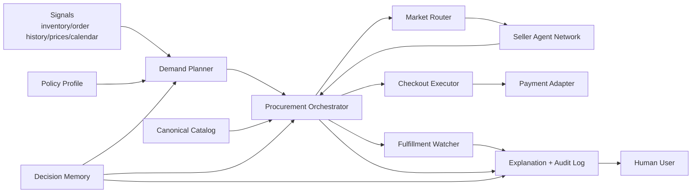
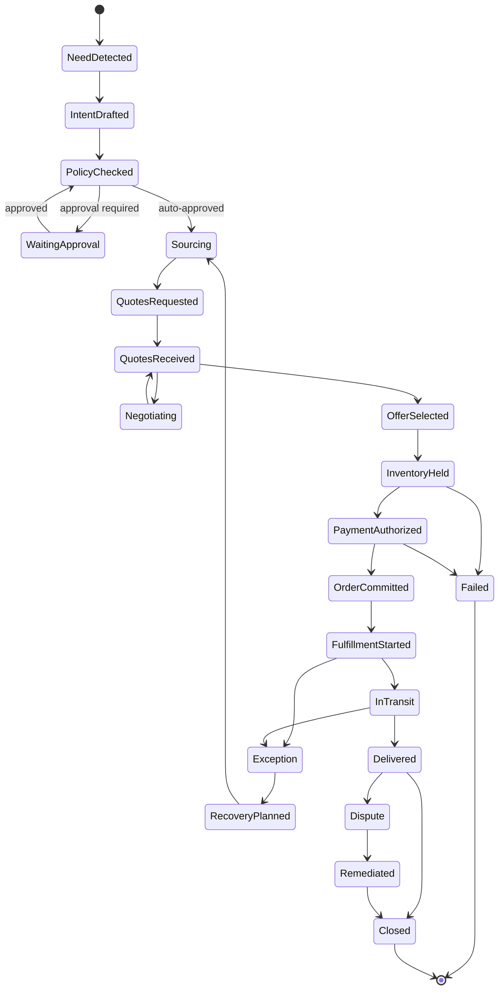

# OpenClaw Native Commerce Architecture Design

**Document Date:** 2026-03-22

**Status:** Implemented MVP baseline

**Objective:** Define a buyer-agent-first commerce architecture where OpenClaw acts as the user's default procurement agent, with structured A2A trade, policy-aware automation, and full auditability.

## 0. Current Implementation Notes

This document started as the target architecture for the initial build. The current branch now implements the MVP baseline and the following details are part of the live architecture rather than open design intent:

- `approval_required` is a real stop-state in the procurement flow; it does not fall through into hold, payment, or commit
- demand-planner receives delivery-window and budget defaults explicitly as planner input instead of fabricating placeholder business facts
- buyer API and procurement service share the same in-memory audit store so `/orders/:id/explanation` reflects the real execution trail
- end-to-end verification exercises the real `seller-sim` Fastify service through a protocol port instead of only using an in-process fake
- architecture guardrails are enforced by source-inspecting tests rather than hardcoded allowlists

---

## 1. Product Thesis

Traditional ecommerce optimizes for human browsing, ad placement, and conversion inside a marketplace UI.

OpenClaw Native Commerce optimizes for:

- machine-readable demand instead of search queries
- policy-constrained autonomous buying instead of manual checkout
- structured RFQ and quote exchange instead of product-page persuasion
- auditability and trust instead of opaque recommendation logic

In this architecture, the primary user is the buyer agent. Human users remain in the loop for policy definition, approval thresholds, exception handling, and trust recovery.

---

## 2. Scope

### In Scope for MVP

- buyer-side demand detection and replenishment planning
- policy engine for budgets, preferences, and approval thresholds
- structured supplier discovery and quote evaluation
- deterministic order orchestration with a typed state machine
- simulated seller-agent protocol for RFQ, quote, inventory hold, and order commit
- payment authorization abstraction
- fulfillment monitoring and exception handling
- auditable decision logs and explanation surfaces
- testable local implementation with mocked connectors

### Out of Scope for MVP

- open seller network with third-party onboarding
- real payment settlement rails
- real logistics integration
- dynamic unconstrained natural-language negotiation
- production-grade trust scoring or insurance
- hardware inventory sensing
- consumer-grade UI polish

---

## 3. Design Principles

1. Deterministic workflow owns execution.
2. LLM components propose; policy and orchestration decide.
3. Every autonomous action must be explainable after the fact.
4. Every module must be independently testable with local fixtures.
5. The system must degrade safely to approval-required mode.
6. Product data is contract-like, not page-like.
7. Integrations are replaceable behind explicit ports.

---

## 4. Recommended Technical Approach

### Option A: Single agent with tools

- Fastest to prototype
- Weak auditability
- Weak control boundaries
- High risk of inconsistent order execution

### Option B: Multi-agent free collaboration

- Closer to "agent economy" narrative
- High coordination complexity
- Hard to verify
- Too much ambiguity for MVP

### Option C: Workflow kernel plus constrained specialists

- Deterministic orchestration
- Narrow LLM use at ambiguity boundaries
- Easy to test
- Supports safe automation and later protocol expansion

**Recommendation:** Option C.

The system should be built as a typed workflow kernel with specialized modules and replaceable tools. This keeps the MVP verifiable while still allowing future migration to richer A2A negotiation.

---

## 5. System Context



---

## 6. Core Modules

### 6.1 Demand Planner

Purpose:

- convert raw signals into structured demand intents
- detect low inventory and replenishment opportunities
- assign urgency and planning windows

Inputs:

- inventory snapshots
- order history
- product consumption heuristics
- price alerts
- calendar constraints
- user policy profile

Outputs:

- `DemandIntent`

Responsibilities:

- threshold-based replenishment
- recurring-demand prediction
- quantity estimation
- preferred delivery window inference

Non-responsibilities:

- supplier selection
- payment
- order execution

### 6.2 Policy Engine

Purpose:

- encode user intent as executable constraints

Policy classes:

- hard rules: never violate
- soft preferences: optimize when possible
- financial rules: thresholds, monthly ceilings, auto-buy limits
- trust rules: approved suppliers, banned sellers, required certifications

Outputs:

- approval requirement
- allowed substitutions
- allowed spend ceiling
- routing constraints

### 6.3 Canonical Catalog

Purpose:

- normalize products from heterogeneous suppliers into a common schema

Responsibilities:

- category normalization
- attribute normalization
- substitution graph
- equivalence scoring

### 6.4 Market Router

Purpose:

- select which supplier pools or seller agents should receive an RFQ

Routing inputs:

- demand intent
- policy restrictions
- seller trust
- geographic constraints
- latency and fulfillment requirements

### 6.5 Seller Protocol Adapter

Purpose:

- translate internal procurement requests into seller-facing protocol messages

MVP protocol actions:

- `RFQ`
- `Quote`
- `CounterOffer`
- `InventoryHold`
- `OrderCommit`
- `OrderEvent`
- `Dispute`

### 6.6 Offer Evaluator

Purpose:

- compare candidate quotes and select the best fit

Scoring dimensions:

- landed cost
- delivery ETA
- policy compliance
- substitution quality
- seller trust
- historical fulfillment reliability

### 6.7 Negotiation Agent

Purpose:

- handle bounded ambiguity

Allowed actions:

- clarify underspecified requirements
- request adjusted pricing
- request adjusted delivery window
- propose acceptable substitutions

Forbidden actions:

- bypass policy
- bind payment
- finalize orders without orchestration approval

### 6.8 Procurement Orchestrator

Purpose:

- execute the typed order lifecycle and compensation logic

Responsibilities:

- state transitions
- retries
- timeout handling
- approval waiting
- failure recovery
- emitting audit events

### 6.9 Checkout Executor

Purpose:

- perform the final commit path once quote, inventory, and approval are ready

Responsibilities:

- inventory hold validation
- payment authorization call
- order commit
- compensation on failure

### 6.10 Fulfillment Watcher

Purpose:

- monitor post-commit events and trigger exception handling

Responsibilities:

- shipment tracking
- SLA breach detection
- replacement or refund routing
- user notifications when required

### 6.11 Explanation and Audit Layer

Purpose:

- provide an after-the-fact rationale for every autonomous decision

Must answer:

- why this demand was triggered
- why this supplier was chosen
- why a substitution was accepted
- why approval was or was not required
- what failed when an order did not complete

### 6.12 Memory Layer

Purpose:

- persist durable context that changes future decisions

Memory partitions:

- profile memory
- operational memory
- vendor memory
- outcome memory

---

## 7. Domain Model

### 7.1 DemandIntent

Fields:

- `id`
- `category`
- `normalizedAttributes`
- `quantity`
- `urgency`
- `deliveryWindow`
- `budgetLimit`
- `substitutionPolicy`
- `sourceSignals`

### 7.2 PolicyProfile

Fields:

- `autoApproveLimit`
- `monthlyBudgetCaps`
- `preferredBrands`
- `requiredCertifications`
- `blockedSellers`
- `deliveryConstraints`
- `substitutionRules`

### 7.3 Offer

Fields:

- `sellerId`
- `items`
- `unitPrices`
- `shippingFee`
- `taxFee`
- `deliveryEta`
- `inventoryHoldTtlSec`
- `serviceTerms`
- `trustSnapshot`

### 7.4 TradeContract

Fields:

- `contractId`
- `buyerAgentId`
- `sellerAgentId`
- `acceptedOffer`
- `paymentTerms`
- `fulfillmentSla`
- `disputePolicy`
- `eventLedger`

### 7.5 FulfillmentJob

Fields:

- `orderId`
- `status`
- `shipmentId`
- `trackingEvents`
- `deadline`
- `exceptionReason`

---

## 8. Order State Machine



State ownership:

- planner owns `NeedDetected` through `IntentDrafted`
- policy engine owns `PolicyChecked`
- orchestrator owns all transitions from sourcing through close
- fulfillment watcher owns post-commit event ingestion

---

## 9. Service Boundaries and Repository Shape

Recommended repository layout:

```text
docs/
  plans/
packages/
  contracts/
  shared/
  catalog/
  policy-engine/
  demand-planner/
  seller-protocol/
  offer-evaluator/
  orchestrator/
  checkout/
  fulfillment/
  memory/
apps/
  api/
  seller-sim/
  review-tools/
tests/
  fixtures/
  contract/
  integration/
  e2e/
```

Rationale:

- contracts stay independent and versioned
- orchestration remains testable without transport concerns
- seller simulator makes protocol and negotiation testable
- app layer stays thin

---

## 10. API Surface for MVP

Buyer-facing API:

- `POST /intents/replenish`
- `POST /orders/:id/approve`
- `GET /orders/:id`
- `GET /orders/:id/explanation`

System-facing API:

- `POST /seller/rfq`
- `POST /seller/quote`
- `POST /seller/order-events`

Internal ports:

- `MarketConnector`
- `PaymentAdapter`
- `InventoryProvider`
- `NotificationPort`
- `AuditLogPort`

---

## 11. Testing Strategy

### Unit Tests

- demand thresholds and quantity inference
- policy rule evaluation
- catalog normalization and substitution scoring
- offer scoring
- state transition guards
- compensation handling

### Contract Tests

- RFQ schema validation
- quote schema validation
- event payload validation
- seller simulator compatibility

### Integration Tests

- low-inventory signal to quote selection
- approval-required path
- inventory hold failure path
- delivery exception recovery path

### End-to-End Tests

Primary scenario:

- inventory falls below threshold
- system creates intent
- policy allows auto-buy
- seller simulator returns two quotes
- best quote selected
- payment authorized
- order committed
- shipment delivered
- explanation endpoint returns full rationale

### Architecture Validation Tests

- no LLM component can directly call payment adapter
- order state transitions only occur through orchestrator
- every committed order has an audit trail

---

## 12. Research Questions Before Full Productionization

1. What minimum product schema is enough for cross-seller substitution?
2. How should trust scores be versioned and surfaced in decisions?
3. Should negotiation remain bounded templates or allow richer natural language?
4. What event-signing format is needed for external seller agents?
5. Which vertical should be used to validate the model first?

---

## 13. Delivery Phases

### Phase 0: Research and design

- capture assumptions and open questions
- fix the canonical domain model
- lock the state machine

### Phase 1: Core buyer kernel

- contracts
- catalog
- policy engine
- demand planner
- offer evaluator
- orchestrator skeleton

### Phase 2: Transaction path

- seller protocol adapter
- seller simulator
- checkout executor
- fulfillment watcher

### Phase 3: Productization

- API app
- explanation endpoint
- architecture conformance tests
- review tooling and implementation review

---

## 14. Code Review and Architecture Conformance Plan

The implementation must end with two explicit reviews:

### 14.1 Code Review

Review dimensions:

- correctness
- safety boundaries
- test completeness
- overbuilding risk
- module coupling

### 14.2 Architecture Comparison Review

Compare implementation against this design document on:

- module boundary alignment
- protocol fidelity
- state machine fidelity
- policy enforcement
- auditability guarantees

Artifacts to produce:

- implementation review document
- architecture conformance matrix
- deferred deviations list

---

## 15. Recommended Success Criteria

MVP is successful when:

- the full replenishment flow can run locally against a seller simulator
- approval thresholds and policy constraints are enforced in tests
- failure compensation is deterministic
- every order exposes an explanation trace
- architecture conformance review shows no critical boundary violations

---

## 16. Recommendation for Execution

Execution should happen with subagent-driven development, one task at a time, with:

- one implementer subagent per task
- one spec-compliance review per task
- one code-quality review per task
- one final cross-cutting code review at the end
- one architecture conformance review against this document at the end
