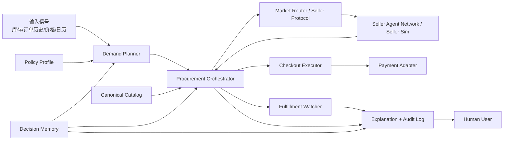
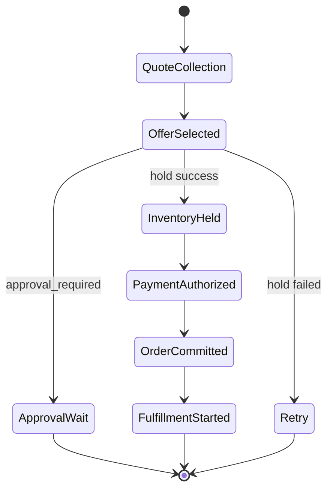

# OpenClaw Native Commerce 架构设计说明（中文）

**文档日期：** 2026-03-22

**状态：** 已实现的 MVP 基线架构

**目标：** 定义一个以买方代理为第一用户的电商架构，使 OpenClaw 能作为用户默认采购代理，完成结构化 A2A 交易、策略约束下的自动采购，以及全链路可审计解释。

## 0. 当前实现说明

这份文档最初是英文版架构设计稿的中文对应说明。当前代码已经实现了 MVP 基线，以下内容已经不是“计划中”，而是当前实现中的真实行为：

- `approval_required` 已经是采购流程中的真实停点，不会继续向 `hold`、`payment`、`commit` 自动穿透
- `demand-planner` 不再伪造交付窗口和预算，而是通过显式输入拿到 planning defaults
- buyer API 与 procurement service 共享同一份内存审计存储，因此 `/orders/:id/explanation` 返回的是实际执行轨迹
- E2E 测试已经通过真实的 `seller-sim` Fastify 服务和协议端口跑通，而不是只依赖进程内假实现
- 架构 guardrails 已改成对真实源码的检查，不再是硬编码 allowlist

---

## 1. 产品命题

传统电商优化的是：

- 人工搜索
- 流量分发
- 商品详情页转化

OpenClaw Native Commerce 优化的是：

- 机器可读需求，而不是搜索词
- 策略约束下的自动采购，而不是人工逐单结算
- 结构化 RFQ / Quote，而不是详情页说服
- 可审计与可解释，而不是黑箱推荐

在这个架构里，第一用户是买方代理，人类用户负责：

- 定义策略
- 设置审批阈值
- 处理异常与争议
- 恢复信任边界

---

## 2. MVP 范围

### MVP 内

- 买方侧需求检测与补货规划
- 预算、偏好、审批阈值的 policy engine
- 结构化供给发现与报价比较
- 类型化订单状态机与确定性编排
- seller-agent 协议的本地模拟实现
- 支付授权抽象
- 履约监控与异常处理
- 审计日志和 explanation 输出
- 本地可跑、可测、可验证的完整闭环

### MVP 外

- 开放卖家网络与第三方自由接入
- 真实支付清结算
- 真实物流集成
- 不受约束的自由语言议价
- 生产级信誉、保险和风控体系
- IoT 级库存感知硬件
- 面向消费者的最终 UI 细节打磨

---

## 3. 设计原则

1. 执行权属于确定性工作流，不属于 LLM。
2. LLM 可以建议，但不能绕过策略与状态机。
3. 每一个自动动作都必须可解释、可回放。
4. 每个模块都必须可以独立测试。
5. 系统在不确定时必须退化到审批模式，而不是继续自动执行。
6. 商品是“机器可执行契约”，不是“商品详情页”。
7. 外部集成必须通过显式 port，以便替换和测试。

---

## 4. 技术路线选择

### 方案 A：单一大 Agent + 一堆 tools

- 优点：最快出效果
- 缺点：不可控、不可审计、容易越权

### 方案 B：自由协作的多 Agent

- 优点：概念上更像未来 Agent 经济
- 缺点：状态混乱、验证困难、MVP 复杂度过高

### 方案 C：工作流内核 + 受约束的专用模块

- 优点：状态清晰、测试友好、适合策略和审批边界
- 缺点：早期“智能感”没那么强，但更可靠

**最终采用：方案 C。**

当前实现就是基于这种方式：

- 类型化 contracts
- 明确的 orchestrator
- 可替换 seller protocol port
- 受控的 policy / checkout / fulfillment 边界

---

## 5. 系统上下文



---

## 6. 核心模块

### 6.1 Demand Planner

职责：

- 根据库存和历史信号生成 `DemandIntent`
- 发现低库存与补货时机
- 估算补货数量

当前实现：

- 基于阈值的补货判断
- 显式 `planningDefaults`
- 最小化的数量推荐逻辑

### 6.2 Policy Engine

职责：

- 将用户策略转换成可执行约束
- 区分：
  - `approved`
  - `approval_required`
  - `rejected`

当前实现：

- 自动审批阈值
- 黑名单卖家
- 必要资质
- 替代策略

### 6.3 Canonical Catalog

职责：

- 标准化不同卖家的商品属性
- 为后续替代品和比较逻辑提供统一 schema

当前实现：

- 先支持 `eggs` 路径
- 属性归一化
- 替代相似度评分

### 6.4 Seller Protocol

职责：

- 定义 RFQ、Quote、Inventory Hold、Order Commit 等消息结构
- 提供 seller side port 接口

当前实现：

- Zod schema 校验
- seller protocol port
- Fastify seller-sim 服务

### 6.5 Offer Evaluator

职责：

- 对报价做确定性排序

评分维度：

- 总成本
- ETA
- 策略匹配度
- 信任分

### 6.6 Procurement Orchestrator

职责：

- 驱动订单状态流转
- 承担失败补偿与异常回退
- 控制审批等待和提交边界

当前实现：

- 类型化状态机
- scenario runner
- 真实 quote 后再做策略判断
- approval-required 停点

### 6.7 Checkout Executor

职责：

- 在满足前置条件后执行 payment authorize 与 commit

当前实现：

- hold 校验
- payment authorize
- commit 调用
- 最小补偿路径

### 6.8 Fulfillment Watcher

职责：

- 监控交付、延迟、异常，并给出 remediation action

### 6.9 Memory / Audit Layer

职责：

- 保存 order snapshot
- 保存 audit event
- 支持 explanation 读取

当前实现：

- 内存存储
- API 与 service 共享同一份 store

### 6.10 Buyer API

职责：

- 提供 replenish 入口
- 返回 order 和 explanation

当前实现：

- `POST /intents/replenish`
- `GET /orders/:id`
- `GET /orders/:id/explanation`

### 6.11 Architecture Guardrails

职责：

- 防止架构边界被代码绕过

当前实现：

- 基于源码检查的测试
- 验证 payment port、order state 和 audit 行为约束

---

## 7. 核心领域对象

### 7.1 DemandIntent

字段：

- `id`
- `category`
- `normalizedAttributes`
- `quantity`
- `urgency`
- `deliveryWindow`
- `budgetLimit`
- `substitutionPolicy`
- `sourceSignals`

### 7.2 PolicyProfile

字段：

- `autoApproveLimit`
- `blockedSellers`
- `requiredCertifications`
- `substitutionRules`

### 7.3 Offer

字段：

- `sellerAgentId`
- `items`
- `shippingFee`
- `taxFee`
- `deliveryEta`
- `inventoryHoldTtlSec`
- `serviceTerms`

### 7.4 TradeContract

字段：

- `contractId`
- `buyerAgentId`
- `sellerAgentId`
- `acceptedOffer`
- `paymentTerms`
- `fulfillmentSla`
- `disputePolicy`

### 7.5 OrderEvent / Audit Event

用途：

- 支撑 explanation
- 支撑 conformance review
- 支撑 E2E 与 API 验证

---

## 8. 订单状态流

当前实现覆盖的核心路径包括：

- 正常提交路径
- inventory hold 失败路径
- approval-required 停止路径



---

## 9. 仓库结构

```text
apps/
  api/
  seller-sim/
docs/
  plans/
  research/
  reviews/
packages/
  catalog/
  checkout/
  contracts/
  demand-planner/
  fulfillment/
  memory/
  offer-evaluator/
  orchestrator/
  policy-engine/
  seller-protocol/
  shared/
tests/
  architecture/
  catalog/
  contract/
  e2e/
  fixtures/
  helpers/
  integration/
  ...
scripts/
  verify.sh
```

---

## 10. 测试与验证策略

当前验证包含：

- unit tests
- contract tests
- integration tests
- E2E tests
- architecture guardrails
- `pnpm verify`

当前主干验证结果：

- 18 个测试文件
- 26 个测试
- 全部通过

---

## 11. 当前架构与设计的一致性结论

当前实现与设计的总体关系是：

- 核心方向一致
- 关键安全边界已落地
- 没有未解决的关键偏差

已接受的 MVP 偏差：

- catalog 目前只覆盖 `eggs` 路径
- memory 和 seller-sim 仍是内存实现
- orchestrator 仍是最小状态集，但已被状态测试和 E2E 覆盖

配套文档：

- 英文架构稿：`docs/plans/2026-03-22-openclaw-native-commerce-design.md`
- 代码审查结果：`docs/reviews/2026-03-22-openclaw-native-commerce-code-review.md`
- 架构一致性检查：`docs/reviews/2026-03-22-openclaw-native-commerce-architecture-conformance.md`
